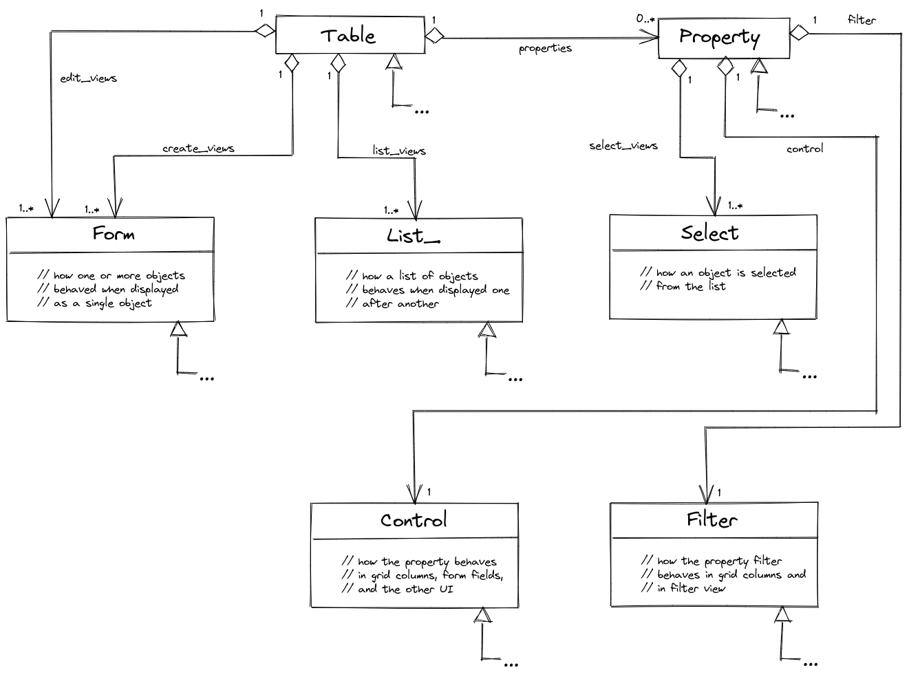

# Reflection

Osm Admin knows every tiny detail about your application objects and properties. And you can, too, using reflection.

***Status**. This specification is a work in progress.*

Contents:

{{ toc }}

### meta.abstract

Osm Admin knows every tiny detail about your application objects and properties. And you can, too, using reflection.

***Status**. This specification is a work in progress.*

## UI

Let's start with a diagram:

### Views

There maybe N configured ways to show an object, or a list of objects, and these "ways" are called *views*.

There are several places in the UI where objects are displayed. Each such place has a dedicated property in the table or class definition. Standard places:

* `$table->list_views`are used on the object list page
* `$table->create_views` - on the object creation page
* `$table->edit_views` - on the object editing page

You can define custom places in the UI by adding more such properties to the table or class definition.

A UI place property, for example `$table->list_views`, is an array of views, having unique view name in its keys.

A view is shown using `?view=<name>` URL parameter.

If the `view` URL parameter is omitted, the default view, having a predefined name, is used:

* `$table->list_views['grid']` is a `Grid`
* `$table->create_views['form']` is a `Form(['mode' => 'create'])`
* `$table->edit_views['form']` is a `Form(['mode' => 'edit'])`

A UI place property expects every view in the list to extend some base class. For example, `$table->list_views` are expected to be instances of `List_`. The UI route and template code are programmed to the expected base class.

A default view is always there, and can't be deleted. However, you can customize it, and define more custom views.

Views can only be defined in `Property` classes, for example, `$record->select_views`.

### Controls

Then, a property of the same type, say `int`, maybe represented in the UI in a number of ways, for example, `Input`, `Select` or `Hidden`. The "way" a property is represented and behaves in the UI, is called *control*, and is stored in `$property->control` property.

Each property type has a default control. For example, by default, `int` properties are shown as `Input`.

### Filters

A property is always filtered using the same URL parameter syntax. For example, `int` property understands `?qty=5+6+7` and `?qty=10-20+40-50` syntax.

However, there are several ways its filter is rendered, for example, `int` property can be displayed as `Options` or `Slider`. The filter type is stored in `$property->filter` property. There is always a default filter associated with the property control type.

## What's Missing In This Specification

* schema
* tables and classes
* properties 
* implementation status/efforts required
* links to the code base
* comments in the code base (if you open a link to the code base, it should be an easy read)